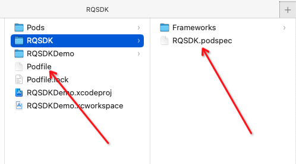
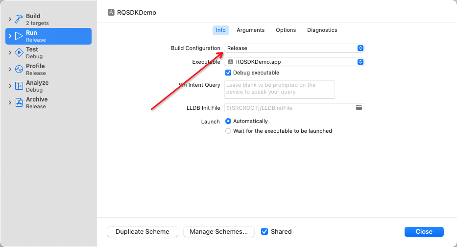
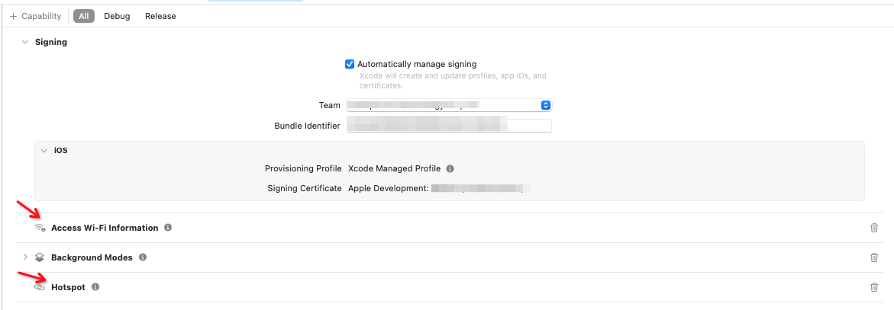

# README

## reoqooKit (aka: RQSDK)

#### Framework架构图


See picture above:

`RQCore`, `RQApi`, `RQWebServices`, `RQDeviceAddition` is the part of`RQSDK`.

`RQCore` provide the base functions and resources support for `RQApi``RQWebServices` `RQDeviceAddition`

When using the SDK, you should use the content of the RQSDK directly, not the dependencies of the RQSDK.

### Usages



~~After the `RQSDKDemo.zip`unzip, you can use Cocoapods command `pod install`to install the SDK that App dependent.~~


2024-10-15: Now, we have a convenient way to install `reoqooKit`
#### Cocoapods
```
source 'https://github.com/CocoaPods/Specs.git'
platform :ios, '13.0'
use_frameworks!

target 'MyApp' do
  pod 'reoqooKit'
end
```

### Caution

#### 2024-10-10: Now, run on release mode is not necessary.
~~If runing the `RQSDKDemo`on the Debug mode, the program crash is possible. Because the RQSDK frameworks is packaging by Release mode, mix the Debug and Release wolud lead the crash happend.~~

~~To avoid program crashes we recommend that the `RQSDKDemo`should be run in release mode.~~



2.  
    #### For now, these frameworks only run on Xcode16.0, not Xcode15.4, not Xcode16.1, just Xcode16.0...compatibility will be improved in the future.

### RQSDKDemo

Don't forget to replace the `app id` from app store, let it query the correct version of your App.

### RQCore
#### Important:
1. the parameter `superVipId` in `RQCore.Agent`: which account you providing to for apple reviewing, that account's id should be set.

### RQDeviceAddition

For `RQDeviceAddition` framework working fine, the Capability in above should be required.
